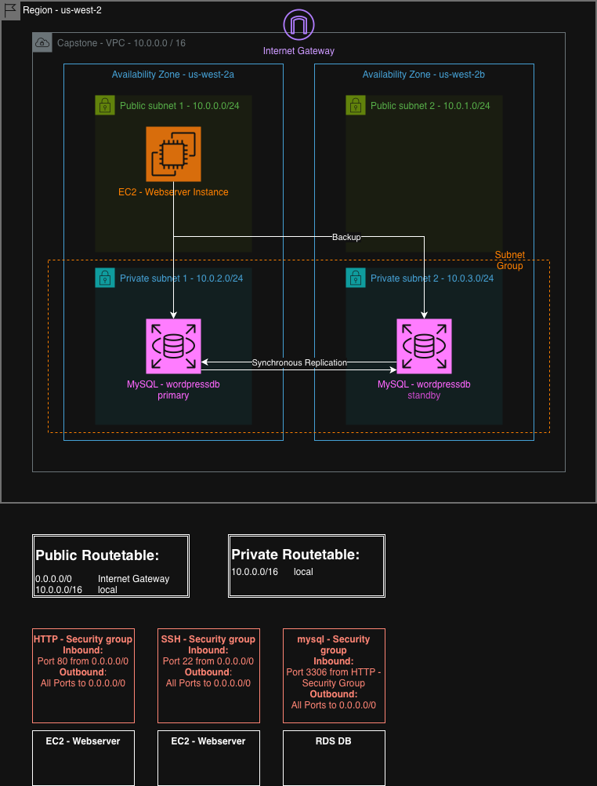

# CapstoneProjectv1 – WordPress on AWS with Terraform

This repository contains my first capstone project from **AWS Cloud Engineer Bootcamp at Neue Fische**.  
It provisions a small but realistic three-tier WordPress setup on AWS using Terraform and a Terraform Cloud (Terraform Hub) workflow.

The focus is **network isolation, basic high availability for the database, and an automated IaC workflow**.

---

## Architecture Overview

---

## Terraform Layout

The configuration is split into simple, single-responsibility files:

```text
CapstoneProjectv1/
├── main.tf                 # ties the resources together and configures the remote backend
├── region.tf               # AWS provider and region configuration
├── vpc-subnet.tf           # VPC, public and private subnets
├── internetgateway.tf      # Internet Gateway and VPC attachment
├── routetable.tf           # public and private route tables and associations
├── securitygroups.tf       # HTTP, SSH and MySQL security groups
├── subnetgroup.tf          # RDS DB subnet group over the private subnets
├── ec2-webserver.tf        # EC2 webserver instance, key pair reference and user data
├── rds-wordpressdb.tf      # RDS MySQL instance for the WordPress database
├── var.tf                  # variable definitions (including all database-related values)
└── ARCHIVE/                # deprecated/experimental files (e.g. older user data script)
```

All resources are currently defined in a single Terraform project for clarity.

---

## CI/CD Workflow (Terraform Hub)

I am using **Terraform Cloud / Terraform Hub** as the remote backend and execution environment.

**Workflow**

1. Write or adjust Terraform code locally in **VS Code**.
2. Commit and **push to GitHub** (`main` branch).
3. The connected Terraform Cloud workspace is configured with **VCS integration**, so each push automatically:
   - runs a **plan**
   - and runs **apply** against AWS.

**Credentials & Secrets**

- AWS credentials and all sensitive values (for example:
  - database name and user
  - database passwords
  - WordPress DB configuration values)
- …are **not committed** to this repository.
- They are configured as **sensitive variables in Terraform Cloud**.  
  The expected variable names are documented in `var.tf`.

---

## How to Use This Repository

This repo is mainly here as a **portfolio / learning artefact**.  
If you want to run it yourself, you will need:

- An AWS account
- A Terraform Cloud account
- A VCS-connected workspace pointing to this GitHub repo
- AWS credentials and all DB/WordPress variables set as **Terraform variables** (check `var.tf` for the exact names)

Once that is in place:

1. Push a change to the repo (or queue a run in Terraform Cloud).
2. Terraform Cloud will run the plan and apply the infrastructure in your AWS account.
3. When the run finishes, the EC2 instance’s public IP can be used in a browser to reach the WordPress site.

---

## Limitations & Next Steps

Current scope:

- Single EC2 instance, **no** load balancer or Auto Scaling group yet.
- No NAT gateway or bastion host.
- Security groups are stricter on the database layer, but SSH is still allowed from anywhere (lab convenience).

Planned follow-ups include:

- Application Load Balancer and Auto Scaling group for the web tier
- Improved access patterns (bastion host, NAT, tighter SSH rules)
- Better observability and hardening (CloudWatch, backups, alarms, etc.)

For now, this repository shows the foundation: **reproducible AWS infrastructure for a WordPress site using Terraform and a simple CI/CD pipeline.**
